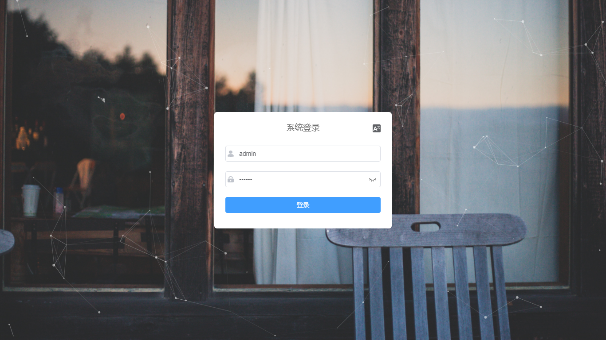
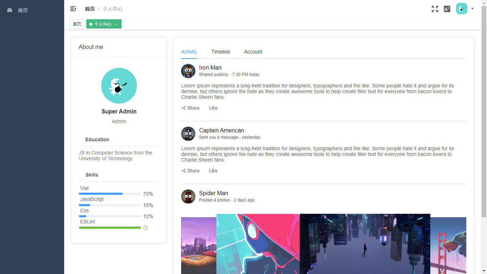

# pure_admin

[简体中文](./README.md) | English

## Project description

Simplify the official project [vue - element - admin] (https://github.com/PanJiaChen/vue-element-admin) background template

## Projects show

[demo](https://xiuguoy.github.io/#/login

## Project start

```bash
# clone the project
git clone https://github.com/xiuguoy/vue-element-admin.git

# enter the project directory
cd pure_admin

# install dependency
npm install

# develop
npm run dev
```

This will automatically open http://localhost:9527

## Build

```bash
# build for test environment
npm run build:stage

# build for production environment
npm run build:prod
```

### The official address

[vue-element-admin](https://panjiachen.github.io/vue-element-admin-site/zh/guide).


## Project screenshots





## License

[MIT](./LICENSE)
