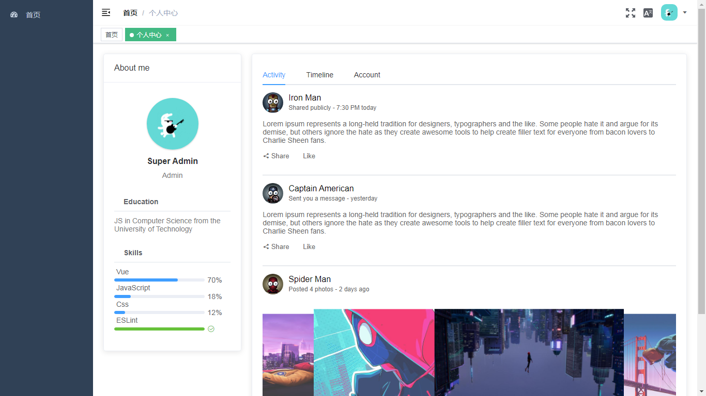

# vue-element-admin

简体中文 | [English](./README-en-US.md)

## 项目描述

简化官方项目[vue-element-admin](https://github.com/PanJiaChen/vue-element-admin)后台模版

## 项目展示

[演示](https://xiuguoy.github.io/#/login)

## 项目启动

```bash
# 克隆项目
git clone https://github.com/xiuguoy/vue-element-admin.git

# 进入项目目录
cd pure_admin

# 安装依赖
npm install

# 建议不要直接使用 cnpm 安装依赖，会有各种诡异的 bug。可以通过如下操作解决 npm 下载速度慢的问题
npm install --registry=https://registry.npm.taobao.org

# 如果安装过程中报 Syntax Error: Error: Cannot find module 'node-sass'
npm install --save-dev node-sass --registry=https://registry.npm.taobao.org --disturl=https://npm.taobao.org/dist --sass-binary-site=http://npm.taobao.org/mirrors/node-sass

# 启动服务
npm run dev

浏览器访问 http://localhost:9527

```

## 发布

```bash
# 构建测试环境
npm run build:stage

# 构建生产环境
npm run build:prod
```

### 官方地址

[vue-element-admin](https://panjiachen.github.io/vue-element-admin-site/zh/guide).


## 项目截图





## License

[MIT](./LICENSE)
